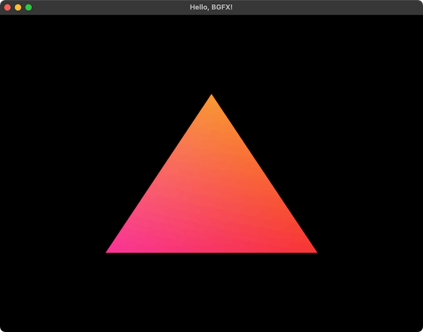

# hello_bgfx_triangle



This is hand writing transcription of https://thatonegamedev.com/cpp/hello-bgfx/ for study. (Upgraded BIG2-stack to v0.0.9)

## Build

```sh
./cmake_init.sh # Only first time
./build.sh
```

## Run

```sh
./run.sh
```

## Status

- [x] GLFW only (`./run.sh glfw_only`)
- [x] GLFW + bgfx basic (`./run.sh basic`)
- [x] Triangle (`./run.sh triangle`)
- [x] Triangle Runtime Shader (`./run.sh triangle_runtime_shader`)
    - NOTE: this example needs `./scripts/compile_shaders.sh` first. see [Compiling Shaders](#compiling-shaders).

### (Other Examples)

- [x] Triangle Alt for examinig bgfx API (`./run.sh triangle_alt`)
- [x] Triangle Debug1 (`./run.sh triangle_debug1`)
    - NOTE: this example shows wireframe triangle.
- [x] Triangle Debug2 (`./run.sh triangle_debug2`)
    - NOTE: this example arbitrarily add corupted program and see stats.

## Compiling Shaders

NOTE: This is only needed for Triangle Runtime Shader example.

- firstly, install bgfx-tools from [for mac](https://www.lwjgl.org/browse/release/3.3.5/macosx/arm64/bgfx-tools), [for win](https://www.lwjgl.org/browse/release/3.3.5/windows/x64/bgfx-tools) or [for linux](https://www.lwjgl.org/browse/release/3.3.5/linux/x64/bgfx-tools)
    - after downloading, please copy `shaderc` to `PATH` directory
    - (for windows, please use git bash)

```bash
bash ./scripts/compile_shaders.sh
```

## License

hello_bgfx_triangle and dependency (big2-stack) are licensed under the Unlicense. see [LICENSE](LICENSE)